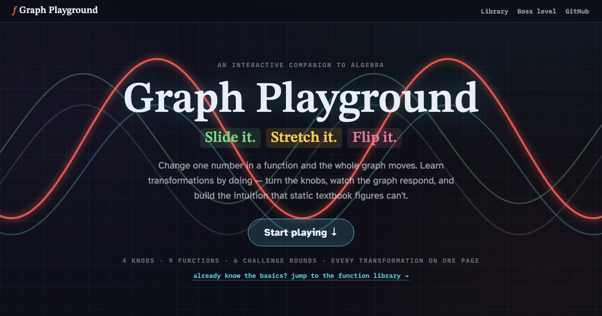

<p align="center">
  
</p>

<h1 align="center">Graph Playground</h1>

<p align="center"><em>Slide it. Stretch it. Flip it.</em><br>
An interactive companion for <em>feeling</em> how a graph moves when you tweak its equation.</p>

<p align="center">
  <strong><a href="https://maninae.github.io/graph-playground/">▶ Play it at maninae.github.io/graph-playground</a></strong>
</p>

---

Why does subtracting 3 *inside* the parentheses slide a graph to the **right**? Textbooks state the rule next to two static pictures and move on — and most kids memorize it, miss it on the test, and decide math isn't for them.

Graph Playground replaces the prose with knobs. Drag a slider, watch the curve move, and build the intuition that static figures can't deliver.

## What's inside

- **A function-machine intro** — drag *x*, watch the output plot itself, then sweep the whole range until the dots melt into a line.
- **The copycat race** — two pens draw at once; the blue pen copies the white pen's every move, three steps late. A delay *is* a slide to the right.
- **Ghost curves and per-point arrows** — every transformation shows where each dot came from and where it went.
- **A function library** — nine parent functions (line, parabola, cubic, |x|, √x, 1/x, 2ˣ, log₂x, sine) with four knobs (`a·f(b(x − h)) + k`) and live dashed asymptotes that follow your knobs.
- **A boss level** — six rounds of match-the-dashed-ghost, with confetti and the clean final equation on every win.

Three color-coded knobs (`a`, `h`, `k`) that mean the same thing in every slider, equation chip, and arrow on the page. No formulas to memorize.

## Run locally

It's a static site — open the live link above and you're done.

If you want to hack on it, ES modules need a server (`file://` won't work):

```bash
python3 -m http.server 8000
# then open http://localhost:8000
```

## How it's built

Plain HTML, CSS, and vanilla JavaScript on a 2D `<canvas>`. No framework, no bundler, no dependencies beyond Google Fonts. The look is [3Blue1Brown](https://www.3blue1brown.com/)-flavored: near-black background, fixed full-page gridlines, manim-bright glowing curves, STIX Two Text for headings and equations.

See [`CLAUDE.md`](CLAUDE.md) for the module map and the load-bearing pedagogical conventions (knob colors, why step 3 uses a dome, why the race curve must be non-periodic).

## License

[MIT](LICENSE)
